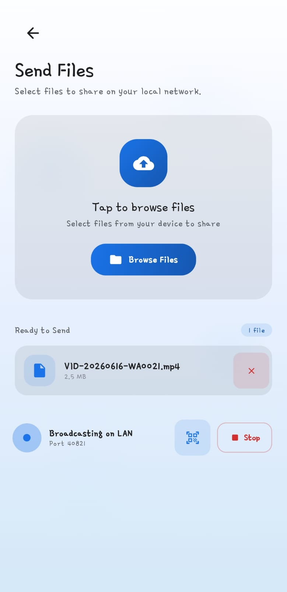
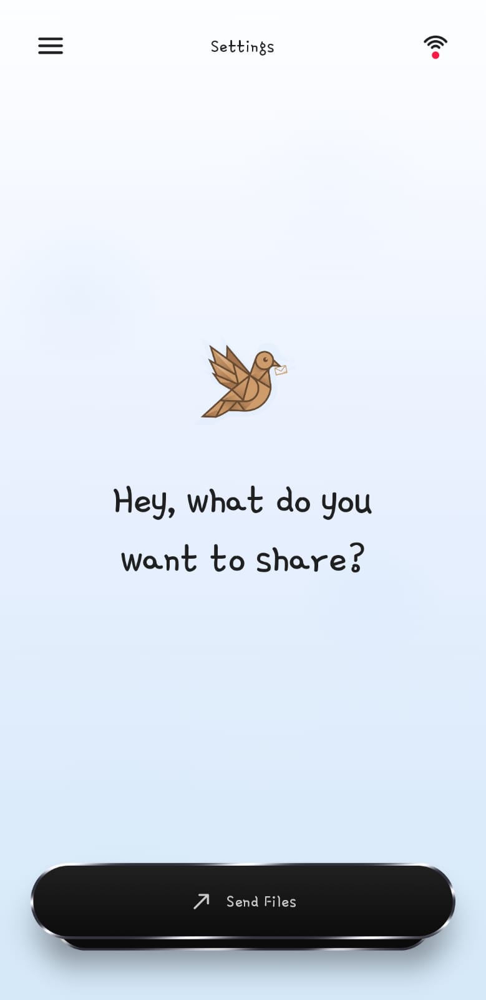
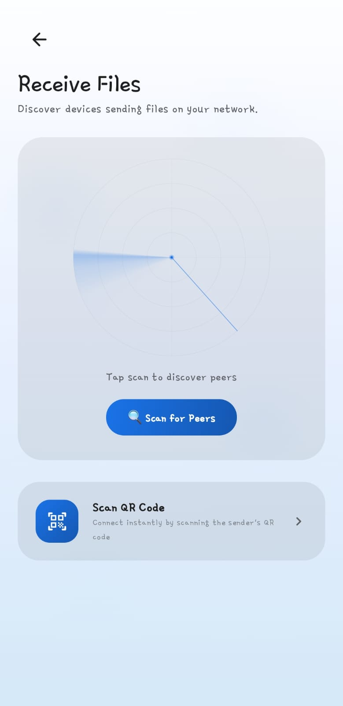
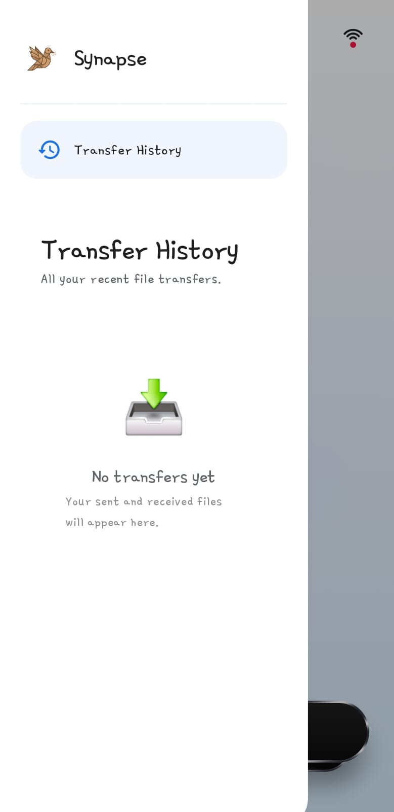
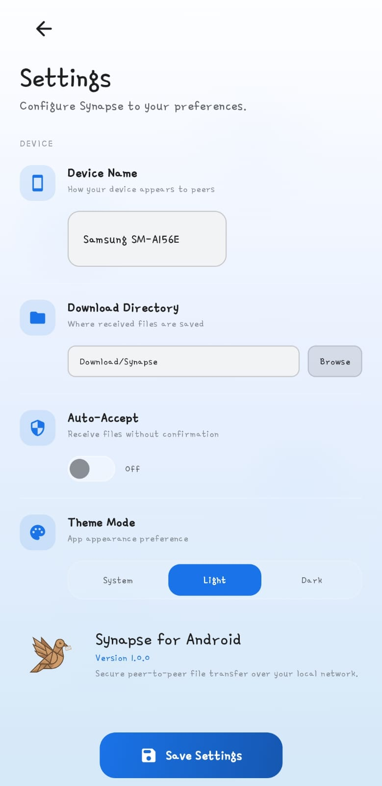

<p align="center">
  
</p>

<p align="center">
  <a href="https://go.dev//">
    
  </a>
  <a href="https://github.com/rootagi/LanDrop">
    
  </a>
  <a href="https://opensource.org/licenses/MIT">
    
  </a>
  <a href="https://wails.io">
    
  </a>
</p>


#  Synapse
Synapse is a high-performance, peer-to-peer file transfer system designed for Local Area Networks. It combines a premium desktop interface built with React and Wails v2 into a single native binary, alongside a modern native Android client built with Jetpack Compose. 

The system leverages zero-configuration mDNS device discovery, instant QR Code pairing, and offline Wi-Fi hotspot sharing. All peer-to-peer transfers are fully encrypted end-to-end via TLS with ephemeral certificates, ensuring fast and secure file sharing across all your devices.

### 💻 Desktop Interface
<table>
  <tr>
    <td><br><b>Send Files</b></td>
    <td><br><b>Receive Files</b></td>
  </tr>
  <tr>
    <td><br><b>Transfer History</b></td>
    <td><br><b>Settings</b></td>
  </tr>
</table>

### 📱 Mobile Interface (Android)
<table>
  <tr>
    <td><br><b>Send</b></td>
    <td rowspan="2" valign="middle"><br><b>Home</b></td>
    <td><br><b>Receive</b></td>
  </tr>
  <tr>
    <td><br><b>Transfer</b></td>
    <td><br><b>Settings</b></td>
  </tr>
</table>

## Features

- **🖥️ Native Desktop GUI** — Premium dark-mode interface built with React, Vite, and Framer Motion on Wails v2. Single binary footprint.
- **📱 Native Android Client** — Elegant Material design app built using Jetpack Compose, featuring smooth micro-animations and clean layouts.
- **🔍 Zero Configuration** — Automatic peer discovery on local networks using mDNS. No IP addresses or setup needed.
- **📷 QR Code Instant Pairing** — Connect instantly by scanning the sender's generated QR code. Uses an optimized, stride-aligned CameraX implementation for robust, freeze-free real-time scanning.
- **🚀 Wi-Fi Hotspot Direct Share** — Share files offline with no network router. The app launches an access point with default display credentials (SSID `Synapse` / Password `qwertyui`).
- **🌐 Universal Web Browser Access** — Any device (iOS, macOS, Windows, Linux) can download shared files without installing the Synapse app by visiting a local web portal (e.g. `http://<ip>:8080`).
- **🔒 End-to-End Encrypted** — Secure socket transmissions using TLS with ephemeral self-signed certificates.
- **✅ Integrity Verified** — Real-time SHA-256 integrity verification prevents corruption during transfer.
- **⏸️ Resumable Transfers** — Automatically detects and resumes partial file transfers.
- **⚡ Adaptive Compression** — Zstandard compression for text/code structures; already-compressed formats are streamed raw.
- **📊 Real-Time Progress** — Live speed, estimated time, and percentage tracking displayed in the GUI.
- **📜 Transfer History** Logged list of transfers with defensive slice copy serialization to prevent concurrency issues.
- **⚙️ Preferences Manager** — Customize device names, default download directories, and auto-accept settings.

## Installation

### Download Pre-built Binaries

Download the latest release from [GitHub Releases](https://github.com/rootagi/Synapse/releases):

| Platform | Download |
|----------|----------|
| **Android** | [`synapse.apk`](https://github.com/rootagi/Synapse/releases) |
| **Windows (Installer)** | [`synapse-amd64-installer.exe`](https://github.com/rootagi/Synapse/releases) |
| **Windows (Portable)** | [`synapse-windows-amd64.zip`](https://github.com/rootagi/Synapse/releases) |
| **Linux (amd64)** | [`synapse-linux-amd64.tar.gz`](https://github.com/rootagi/Synapse/releases) |

### 📱 Synapse for Android

The Android version brings the same clean experience to your mobile device.

1. **Download** the `synapse.apk` from the latest release.
2. **Install** it on your Android device (ensure "Install from Unknown Sources" is enabled).
3. **Permissions**: The app requires "Nearby Devices" permission for discovery, "Camera" permission for QR scanning, and "Files/Media" access for transfers.

#### Linux Requirements
```bash
sudo apt install libgtk-3-0 libwebkit2gtk-4.1-0
```

#### Windows Requirements
- WebView2 Runtime (included in Windows 10/11)

### Build from Source

#### Prerequisites

- Go 1.21+
- Node.js 18+ (for frontend Vue/React build)
- [Wails CLI](https://wails.io/docs/gettingstarted/installation) v2
- Linux: `libgtk-3-dev` and `libwebkit2gtk-4.1-dev`

```bash
# Install Wails CLI
go install github.com/wailsapp/wails/v2/cmd/wails@latest

# Clone and build
git clone https://github.com/rootagi/LanDrop.git
cd LanDrop

# Linux
wails build -tags webkit2_41

# Windows (on a Windows machine)
wails build
```

The binary will be at `build/bin/synapse` (or `synapse.exe` on Windows).

## Usage

### Send Files

1. Open Synapse.
2. Go to the **Send Files** tab.
3. Click **Browse Files** or **Select Folder** to queue payloads.
4. Click **Start Sending** to begin broadcasting on your local network.
5. If on Android, you can show a **QR Code** for instant pairing or start an offline **Hotspot Direct Share**.

### Receive Files

1. Open Synapse on the receiving device.
2. Go to the **Receive Files** tab.
3. Click **Scan for Peers** (discovered senders appear as cards) or tap **Scan QR Code** to use the camera.
4. Click **Connect to Receive** on the desired sender to start the transfer.
5. Files download to your configured download directory.

### Universal Browser Download (Web Portal)

If the receiver doesn't have Synapse (e.g. an iPhone, iPad, or a work PC):
1. Start sharing files via **Hotspot Direct Share** or regular Send mode.
2. Tell the receiver to connect to your Wi-Fi network (or your phone's Wi-Fi hotspot).
3. Open any web browser on the receiving device and go to: `http://<sender-ip>:8080` (displayed on the sender's screen).
4. Tap **Download** next to any shared file.

### Settings

- **Device Name** — Customize how your device appears to peers.
- **Download Directory** — Customize where received files are saved.
- **Auto-Accept** — Automatically accept incoming connections without prompts.

### Development Mode

```bash
# Hot-reload dev server
wails dev -tags webkit2_41
```

## Architecture

```
synapse/
├── main.go                    # Wails app entrypoint
├── gui/
│   ├── app.go                 # Wails-bound methods (send, receive, scan, etc.)
│   ├── settings.go            # Config persistence (~/.config/synapse/)
│   └── history.go             # Transfer history
├── frontend/
│   ├── src/
│   │   ├── main.jsx           # React app entry
│   │   ├── App.jsx            # Main app shell & router
│   │   ├── tabs/              # Tab components (Send, Receive)
│   │   └── components/        # Isolated UI components
│   ├── package.json           # Frontend dependencies
│   └── vite.config.js         # Vite bundler configuration
├── internal/
│   ├── discovery/             # mDNS discovery (_synapse._tcp)
│   └── transfer/
│       ├── sender.go          # TLS sender with progress callbacks
│       ├── receiver.go        # TLS receiver with progress callbacks
│       ├── protocol.go        # Wire protocol (headers, chunking)
│       └── security.go        # Ephemeral TLS certificate generation
├── android/
│   ├── app/src/main/
│   │   ├── AndroidManifest.xml # Permissions, activities, and service declarations
│   │   └── java/com/synapse/lantransfer/
│   │       ├── MainActivity.kt # Entrypoint and Compose navigation
│   │       ├── ui/
│   │       │   ├── screens/    # HomeScreen, SettingsScreen, HotspotShareScreen
│   │       │   └── components/ # QRCodeScanner, StackedSwipeComponent
│   │       └── util/
│   │           ├── HotspotManager.kt # System hotspot wrappers
│   │           └── SimpleHttpFileServer.kt # ServerSocket-based web portal
└── .github/workflows/
    └── release.yml            # CI/CD: build Linux + Windows, create release
```

### Wire Protocol

All transfers use TLS over TCP with this protocol:

1. **Header**: 8-byte length + JSON Metadata (`{"name", "size", "compression", ...}`)
2. **Request**: 8-byte length + JSON (`{"offset": ...}`) for resume support
3. **Content**: Raw or Zstd-compressed stream (chunked encoding if compressed)
4. **Footer**: SHA-256 checksum (32 bytes on wire)

## Troubleshooting

- **"No peers found"** — Ensure both devices are on the same network. Some corporate/public WiFi networks block mDNS (multicast) or peer-to-peer packets.
- **Firewall** — Allow incoming TCP connections on your configured port and UDP multicast (port 5353).
- **Checksum Mismatch** — Retry the transfer; it will automatically resume.
- **Linux: App won't start** — Install runtime dependencies: `sudo apt install libgtk-3-0 libwebkit2gtk-4.1-0`

## License

MIT [LICENSE](LICENSE)
